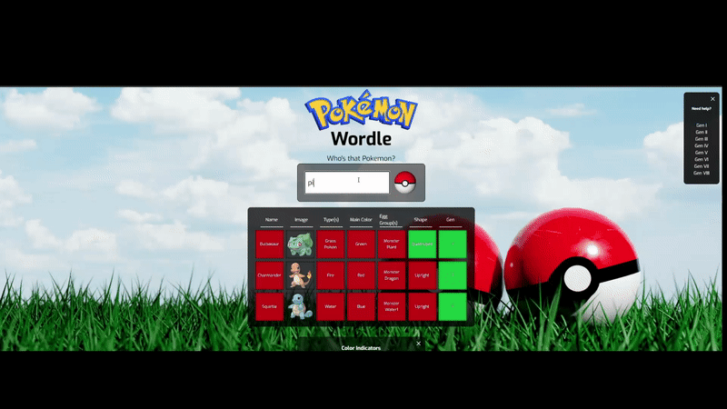
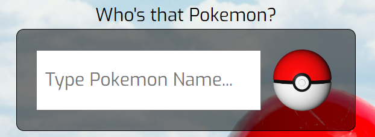
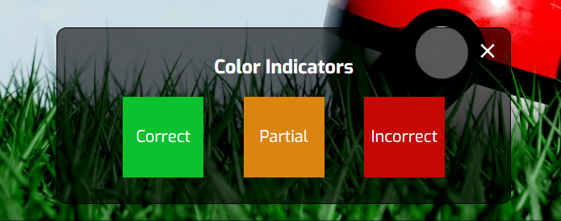
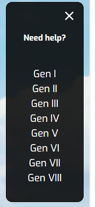

# Pokemon Wordle

This web app is a project I started for fun to learn how to use Typescript and SASS in React! I plan on continually iterating on this project, stay tuned for updates! List of ideas I have in mind are listed below.

## How To Play

Here's a demo!

Type in the name of any Pokemon,

and see if you can figure out which one it is based on the clues!

Links are provided on the side if you need a list of Pokemon to help you guess

## Deployment

This project is currently deployed at https://pokemon-wordle.netlify.app

## Patches

1.0 (10/3/2022) First implementation of the game <3

## Projected Updates

(in no particular order)

- Add in the possibilities of regional-variants as separate entries
- Have the Pokemon set for the day instead of changing to a new one on refresh
- Add in additional fields like "can evolve", "part of evolution", "evolution criteria", etc.
- Make the input field populate suggestions to prevent possible bad queries (I'm not sure how regional variants are handled by the API, will do more research)
- Section off game modes so players can choose to play with Gen I, Gen II, etc. Pokemon only, or play with all 900+ being possible
- Make the page more mobile-friendly
- Utilize more SASS-specific features for repeated code
- Add a colorblind mode for improved accessibility
- Anything I can think of to improve the player's quality of life :)

## Tech Stack

**Client:** React, SASS, Typescript

**Server:** Node

## Acknowledgements

- [Pimeko](https://ko-fi.com/pimeko) - I play LoLdle every night with my girlfriend and was inspired to replicate the game to practice my front-end development skills. Thanks for making a fun game!
